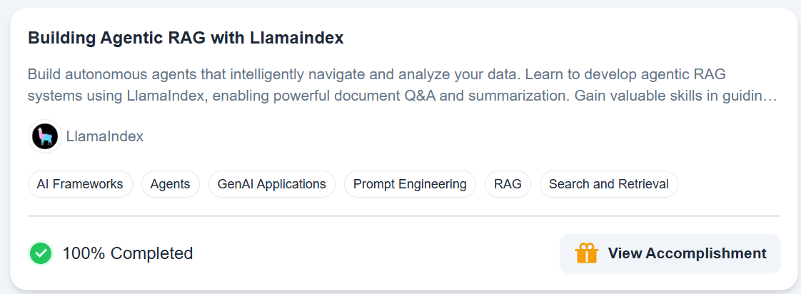

Course from deeplearning.ai

https://learn.deeplearning.ai/courses/building-agentic-rag-with-llamaindex

# python env

create llamaindex env from env/llamaindex.txt

optionnaly add 
/home/guillaume/miniconda/envs/llamaindex/lib/python3.11/site-packages 
in python.analysis.extraPaths (vscode settings)

# llm config

copy OPENAI_API_KEY in .env

or

copy AZURE_API_KEY, AZURE_ENDPOINT, AZURE_API_VERSION in .env

# pre-commit

just run `pre-commit install`